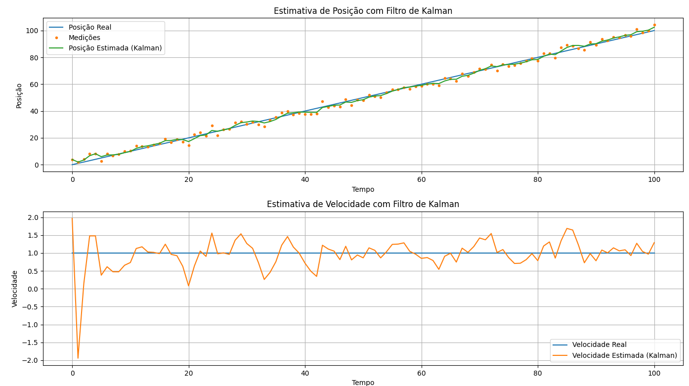

# 5. Filtro de Kalman

### 1. O que é o Filtro de Kalman e por que ele é necessário

O Filtro de Kalman é um **algoritmo de estimação de estados ótimo** que foi desenvolvido por Rudolf E. Kálmán, com a publicação de seu trabalho em 1960. Ele é descrito como um método para **lidar com variáveis contínuas, estimando variáveis de estado (como posição e velocidade) a partir de observações ruidosas ao longo do tempo**.

A necessidade do Filtro de Kalman surge da **incerteza inerente a sistemas dinâmicos**. Em cenários práticos, as medições de sensores são ruidosas e imprecisas, e o próprio sistema em observação pode sofrer de "ruído de processo" devido a fatores imprevisíveis, como vento ou atrito. Como demonstrado nos slides da aula 20, o filtro de Kalman permite fazer uma "suposição educada" sobre o que o sistema dinâmico fará a seguir, mesmo com informações incertas. Ele se destaca em **combinar informações incertas** para gerar uma estimativa mais precisa do estado do sistema.

Kenneth Craik, em um trabalho que influenciou a ideia de agentes baseados em conhecimento, argumentou que se um organismo possui um "modelo em pequena escala" da realidade externa e de suas próprias ações, ele pode testar alternativas, prever situações futuras, e reagir de forma mais "completa, segura e competente" [13, p. 13]. O filtro de Kalman incorpora essa ideia ao prever e corrigir continuamente suas estimativas, permitindo que um sistema inteligente opere de forma mais robusta em ambientes imprevisíveis.

### 2. Estimativas de estados contínuos com ruído

O Filtro de Kalman é projetado para sistemas caracterizados por **variáveis de estado contínuas e medições ruidosas**. Ele assume que tanto o modelo de transição do sistema (como o estado evolui ao longo do tempo) quanto o modelo do sensor (como as medições são obtidas) podem ser representados por **distribuições lineares Gaussianas com ruído aditivo Gaussiano**.

Em um modelo Gaussiano, o estado do sistema é especificado por uma **média ($\mu$) e uma matriz de covariância ($\Sigma$)**. A média representa a melhor estimativa do estado, enquanto a covariância quantifica a incerteza associada a essa estimativa. Conforme Russell e Norvig (2010, p. 51), a condição de que o próximo estado seja uma função linear do estado atual, mais algum ruído Gaussiano, é "bastante razoável na prática". O ruído, tanto de processo quanto de medição, é assumido como Gaussiano com média zero.

Como demonstrado nos slides da aula 20, essas distribuições Gaussianas são representadas como "borrões" (blobs) no espaço de estados, onde o tamanho e a orientação do borrão indicam a incerteza (variância) e a correlação entre as variáveis.

### 3. A estrutura do filtro: previsão e atualização

A operação do Filtro de Kalman é um **ciclo contínuo de "previsão-correção"**. Ele estima o próximo estado, calcula um termo de erro com base na medição real, e usa ambos para refinar a próxima previsão.

<a href="https://www.researchgate.net/figure/The-Predict-Correct-Cycle-of-the-Kalman-Filter-Algorithm_fig5_242369888"></a>

Figure 4: The Predict-Correct Cycle of the Kalman Filter Algorithm.

#### Previsão (Predict)
Nesta etapa, o filtro **projeta o estado atual e sua incerteza para o futuro**. Como demonstrado nos slides da aula 20, a estimativa do estado anterior ($\mathbf{\hat{x}}_{k-1}$) é usada para prever o próximo estado ($\mathbf{\hat{x}}_k$), incorporando também quaisquer influências externas de controle ($\mathbf{u}_k$). O "novo" ruído de processo é adicionado para expandir a covariância.
Russell e Norvig (2010, p. 272) descrevem as equações de previsão da seguinte forma:

*   **Estado previsto**: $\hat{x}_{t+1} = A x_t + B u_t$
*   **Covariância prevista**: $\hat{\Sigma}_{t+1} = A \Sigma_t A^T + Q$

Onde $A$ é a matriz de transição de estados, $B$ é a matriz de controle, $u_t$ é o vetor de controle, $\Sigma_t$ é a covariância do estado atual, e $Q$ é a matriz de covariância do ruído de processo.

#### Atualização (Update)
Após a previsão, o filtro **incorpora a nova medição recebida para refinar a estimativa do estado**. Como demonstrado nos slides da aula 20, a medição ($\mathbf{z}_k$) é comparada com a medição esperada com base no estado previsto ($\mathbf{H}\mathbf{\hat{x}}_k$), gerando um resíduo ou erro ($\varepsilon$). O filtro calcula um **Ganho de Kalman ($K$)**, que determina o quanto a nova medição influenciará a estimativa do estado. Se a medição for muito ruidosa, o sistema confiará mais em sua estimativa atual; caso contrário, a medição terá mais peso.
As equações de atualização são dadas por Russell e Norvig (2010, p. 272):

*   **Erro na estimativa**: $\varepsilon = y_{t+1} - H A x_{t+1}$
*   **Ganho de Kalman**: $K = \hat{\Sigma}_{t+1} H^T (H \hat{\Sigma}_{t+1} H^T + R)^{-1}$
*   **Estado atualizado**: $x_k = x_p + K (z_k - H x_p)$
*   **Covariância atualizada**: $P_k = P_p - K H P_p$

Onde $H$ é a matriz de observação (transforma o estado em medição) e $R$ é a matriz de covariância do ruído de medição. Este processo é iterativo, com a estimativa atualizada servindo como base para a próxima previsão.

### 4. Relação com o filtro Bayesiano

O Filtro de Kalman é uma **instância específica do filtro Bayesiano**, aplicado a sistemas que seguem modelos lineares Gaussianos. Russell e Norvig (2010, p. 55) explicam que, se a distribuição do estado atual é Gaussiana e o modelo de transição é linear Gaussiano, a distribuição prevista para o próximo estado também será Gaussiana. Da mesma forma, se a previsão é Gaussiana e o modelo do sensor é linear Gaussiano, a distribuição atualizada após a nova evidência também será Gaussiana.

Como demonstrado nos slides da aula 18, o cálculo de filtragem, que busca a distribuição a posteriori do estado mais recente dadas todas as evidências até o momento, é decomposto em duas partes: a **projeção para frente da distribuição de estados e a atualização com a nova evidência**. Essa abordagem recursiva é fundamentada na regra de Bayes e na independência condicional. Assim, o Filtro de Kalman é uma forma elegante de aplicar a inferência probabilística Bayesiana em ambientes dinâmicos contínuos, onde a representação Gaussiana permite que a distribuição de estado seja mantida de forma compacta ao longo do tempo.

### 5. Vantagens e limitações

#### Vantagens
*   **Estimação Ótima**: O Filtro de Kalman é um "algoritmo de estimação de estados ótimo" para sistemas lineares com ruído Gaussiano, no sentido de que minimiza a variância do erro de estimação.
*   **Eficiência Computacional**: É ideal para sistemas que mudam continuamente e são adequados para problemas de tempo real e sistemas embarcados, pois não precisam manter um histórico completo de observações.
*   **Estimativa de Variáveis Ocultas**: Pode estimar variáveis que não são diretamente observáveis, como a velocidade de um objeto a partir de medições de posição.
*   **Combinação de Dados**: Integra dados de múltiplos sensores e previsões do modelo para produzir uma estimativa mais precisa do estado.

#### Limitações
*   **Pressupostos Fortes**: A principal limitação são as "suposições muito fortes" de modelos de transição e sensor lineares e Gaussianos. Se o sistema não for linear ou o ruído não for Gaussiano, a estimativa pode ser "muito pobre".
*   **Não-Linearidades**: Para lidar com não-linearidades, são necessárias extensões como o **Filtro de Kalman Estendido (EKF)** ou o **Filtro de Kalman Não-Centrado (UKF)**. O EKF lineariza o sistema localmente em torno da média do estado, enquanto o UKF usa uma abordagem baseada em amostragem.
*   **Distribuições Arbitrárias**: O Filtro de Kalman representa a distribuição de estado como uma única distribuição Gaussiana. Isso o torna inadequado para modelar situações com múltiplas possibilidades ou distribuições não-Gaussianas complexas. Nesses casos, o **Filtro de Partículas** é mais apropriado.

### 6. Exemplo simples com gráfico

No contexto de um sistema unidimensional, como um "caminhada aleatória" (random walk) com ruído, o Filtro de Kalman permite visualizar como a incerteza da estimativa muda ao longo do tempo. Russell e Norvig (2010, p. 57) ilustram isso com um gráfico que mostra as etapas do ciclo de atualização do filtro de Kalman. A distribuição inicial do estado (por exemplo, $P(x_0)$) é uma Gaussiana. Após a previsão (incorporando ruído de transição), a distribuição ($P(x_1)$) se "acha", indicando um aumento na incerteza. Quando uma nova observação ($z_1$) é incorporada, a distribuição a posteriori ($P(x_1 | z_1)$) se torna mais estreita, e sua média é um "média ponderada" da previsão e da observação, movendo-se ligeiramente para a esquerda da observação neste exemplo.

O código `Kalman_Simple_Exemple.py` provavelmente demonstra este comportamento em uma simulação, mostrando a evolução da estimativa e de sua covariância (incerteza) à medida que novas medições são processadas. De forma semelhante, o `Kalman_Simple_Exemple_2.py` deve explorar variações ou complexidades adicionais do filtro, talvez em duas dimensões ou com diferentes níveis de ruído, como os exemplos visuais de rastreamento em 2D vistos nos slides da aula 20.

### 7. Aplicações em rastreamento, visão computacional, robótica

O Filtro de Kalman e suas extensões são amplamente utilizados em uma "vasta gama de aplicações".

*   **Rastreamento**: Uma aplicação "clássica" é o **rastreamento de alvos**, como aeronaves e mísseis em radares. Inclui também o rastreamento acústico de submarinos e veículos terrestres, e o rastreamento visual de veículos e pessoas. O filtro foi implementado para as missões Apollo para estimar as trajetórias de foguetes.
*   **Visão Computacional e Processamento de Sinais**: É fundamental para "rastrear padrões complexos de movimento em vídeo" e no "processamento de sinais" em geral.
*   **Robótica**: Essencial para a **localização e mapeamento de robôs (SLAM)**. Como demonstrado nos slides da aula 20, é utilizado em sistemas de navegação e piloto automático. A Monte Carlo Localization (MCL), por exemplo, é uma aplicação do filtro de partículas para a localização de robôs.

Além dessas áreas, Russell e Norvig (2010, p. 59) mencionam a reconstrução de trajetórias de partículas em fotografias de câmaras de bolhas, correntes oceânicas a partir de medições de satélite, e sistemas em indústrias como papel e celulose, plantas químicas, reatores nucleares, ecossistemas e economias nacionais.


## Projeto

### Cenário: Estimativa de Posição e Velocidade com Filtro de Kalman

Neste projeto, exploramos o uso do **Filtro de Kalman** para estimar a posição e a velocidade de um objeto ao longo do tempo, a partir de medições ruidosas de posição. Este cenário simula um problema clássico em controle e robótica, onde o objetivo é acompanhar o estado dinâmico de um sistema (posição e velocidade) que não pode ser observado diretamente sem ruído.

### Construção do Modelo

O filtro de Kalman é um algoritmo recursivo que combina as medições observadas com um modelo de transição do sistema para gerar estimativas ótimas do estado, mesmo na presença de ruído e incertezas.

* O vetor de estado possui duas variáveis: posição e velocidade.
* O modelo assume que a posição no próximo instante é a posição atual mais a velocidade vezes o intervalo de tempo (`dt`), enquanto a velocidade se mantém constante.
* As medições observadas correspondem somente à posição, que é afetada por ruído gaussiano.
* As matrizes do filtro (transição de estado, de observação, covariâncias de ruído) são definidas para refletir essas relações e incertezas.
* O filtro inicia com uma grande incerteza inicial sobre o estado para permitir correção a partir das medições.
* Durante a execução, o filtro realiza previsões e atualizações iterativas para refinar as estimativas conforme novas medições chegam.

Este método é amplamente utilizado em sistemas de navegação, rastreamento, robótica e qualquer aplicação que exija estimação de estados dinâmicos a partir de dados ruidosos.


### Código Python


```python

import numpy as np
from filterpy.kalman import KalmanFilter
import matplotlib.pyplot as plt

# 1. Criando o Filtro de Kalman

# dim_x: número de variáveis de estado (posição e velocidade)
# dim_z: número de variáveis de medição (posição)
f = KalmanFilter(dim_x=2, dim_z=1)

# 2. Definindo as Matrizes do Filtro

# Matriz de Transição de Estado (F)
# Descreve como o estado evolui de um passo de tempo para o próximo.
# [posição_nova] = [1 * posição_antiga + dt * velocidade_antiga]
# [velocidade_nova] = [0 * posição_antiga + 1 * velocidade_antiga]
dt = 1.0  # intervalo de tempo
f.F = np.array([[1., dt],
                [0., 1.]])

# Matriz de Medição (H)
# Mapeia o estado para o espaço de medição.
# [medição_posição] = [1 * posição + 0 * velocidade]
f.H = np.array([[1., 0.]])

# Covariância do Ruído do Processo (Q)
# Representa a incerteza no modelo do sistema.
# Assumimos que a velocidade pode variar um pouco.
from filterpy.common import Q_discrete_white_noise
f.Q = Q_discrete_white_noise(dim=2, dt=dt, var=0.1)

# Covariância do Ruído da Medição (R)
# Representa a incerteza nas medições.
# Assumimos que nossas medições de posição têm um certo ruído.
f.R = np.array([[5.]])

# 3. Estado Inicial e Incerteza Inicial

# Estado Inicial (x)
# [posição_inicial, velocidade_inicial]
f.x = np.array([[0.],
                [0.]])

# Covariância Inicial (P)
# Representa a incerteza inicial sobre o estado.
# Começamos com uma grande incerteza.
f.P = np.array([[1000., 0.],
                [0., 1000.]])

# 4. Simulação e Filtragem

# Gerando dados simulados com ruído
np.random.seed(0)
posicao_real = np.linspace(0, 100, 101)
velocidade_real = np.ones(101)
medicoes = posicao_real + np.random.normal(0, np.sqrt(f.R[0, 0]), 101)

# Listas para armazenar os resultados
posicoes_estimadas = []
velocidades_estimadas = []

for z in medicoes:
    # Previsão
    f.predict()

    # Atualização
    f.update(z)

    # Salvando a estimativa
    posicoes_estimadas.append(f.x[0, 0])
    velocidades_estimadas.append(f.x[1, 0])

# 5. Visualizando os Resultados

plt.figure(figsize=(12, 8))

# Posição
plt.subplot(2, 1, 1)
plt.plot(posicao_real, label="Posição Real")
plt.plot(medicoes, ".", label="Medições")
plt.plot(posicoes_estimadas, label="Posição Estimada (Kalman)")
plt.title("Estimativa de Posição com Filtro de Kalman")
plt.xlabel("Tempo")
plt.ylabel("Posição")
plt.legend()
plt.grid(True)

# Velocidade
plt.subplot(2, 1, 2)
plt.plot(velocidade_real, label="Velocidade Real")
plt.plot(velocidades_estimadas, label="Velocidade Estimada (Kalman)")
plt.title("Estimativa de Velocidade com Filtro de Kalman")
plt.xlabel("Tempo")
plt.ylabel("Velocidade")
plt.legend()
plt.grid(True)

plt.tight_layout()
plt.show()

```

### Resultado




### Considerações Finais

O filtro de Kalman demonstrou ser uma ferramenta poderosa para estimar estados dinâmicos, como posição e velocidade, mesmo com medições ruidosas e incertezas no modelo. Sua aplicação prática é essencial em diversas áreas, destacando-se pela capacidade de fornecer estimativas confiáveis em tempo real, o que o torna fundamental em robótica, navegação e sistemas de controle.


---

### Referências


*   Russell, S., & Norvig, P. (2010). *Artificial Intelligence - A Modern Approach* (3rd ed.). Prentice Hall. (Observação: As citações no texto referem-se à 3ª edição, que o usuário especificou como "Russell e Norvig (2010)", embora algumas menções nos materiais originais possam referir-se a edições anteriores).
*   Jurafsky, D., & Martin, J. H. (2021). *Speech and Language Processing* (Draft of December 29, 2021). (Disponível em formato PDF como "Daniel Jurafsky2021.pdf").
*   FGA0221 – Inteligência Artificial. (s.d.). *Redes Bayesianas*. (Material de aula em formato PDF: "FGA0221 – IA - 16.pdf").
*   FGA0221 – Inteligência Artificial. (s.d.). *Redes Bayesianas – 2ª Parte*. (Material de aula em formato PDF: "FGA0221 – IA - 17.pdf").
*   FGA0221 – Inteligência Artificial. (s.d.). *Raciocínio probabilístico ao longo do tempo*. (Material de aula em formato PDF: "FGA0221 – IA - 18.pdf").
*   FGA0221 – Inteligência Artificial. (s.d.). *Raciocínio probabilístico ao longo do tempo – Parte 2*. (Material de aula em formato PDF: "FGA0221 – IA - 19.pdf").
*   FGA0221 – Inteligência Artificial. (s.d.). *Filtro de Kalman Expanation*. (Material de aula em formato PDF: "FGA0221 – IA - 20.pdf").
*   Alpaydin, E. (2014). *Machine Learning - An Algorithmic Perspective* (2nd ed.). Springer. (Disponível em formato PDF como "Machine Learning - An Algorithmic Perspective 2nd edition 2014.pdf").
*   Sutton, R. S., & Barto, A. G. (2015). *Reinforcement Learning: An Introduction* (2nd ed.). A Bradford Book, The MIT Press. (Disponível em formato PDF como "Reinforcement-Learning:_An_Introduction.pdf").
*   Luger, G. F. (2008). *Artificial intelligence: Structures and strategies for complex problem solving* (6th ed.). Pearson Education. (Disponível em formato PDF como "artificial intelligence structures and strategies for complex problem solving.pdf").
* Real-Time Structure from Motion Using Kalman Filtering - Scientific Figure on ResearchGate. Available from: https://www.researchgate.net/figure/The-Predict-Correct-Cycle-of-the-Kalman-Filter-Algorithm_fig5_242369888 [accessed 14 Jul 2025]

---

| Versão | Data       | Modificação         | Nome                 | GitHub                                      |
|--------|------------|---------------------|----------------------|---------------------------------------------|
| `1.0`  | 16/07/2025 | Criação do documento | Ana Beatriz Norberto | [@ananorberto](https://github.com/ananorberto) |

