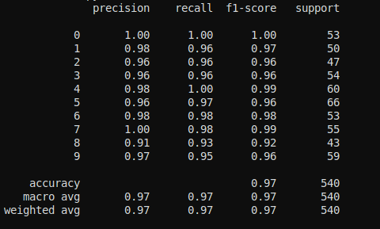
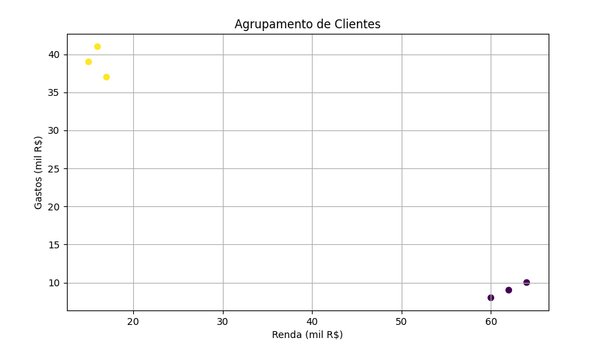
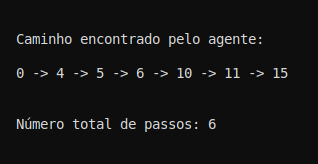

# 2. Projetos em Aprendizado de Máquina

Este documento detalha os projetos desenvolvidos para o portfólio de Aprendizado de Máquina da disciplina de Inteligência Artificial, ilustrando as principais abordagens de aprendizado de máquina. Cada projeto visa conectar a teoria apresentada em sala de aula e no livro-texto com implementações práticas, demonstrando a aplicação dos conceitos na resolução de problemas específicos.

Com base na perspectiva de Russell & Norvig (2010), a Inteligência Artificial é o estudo de agentes que percebem o ambiente e realizam ações racionais para atingir seus objetivos. Assim, o Aprendizado de Máquina aparece como uma ferramenta essencial para permitir que os agentes se adaptem a ambientes desconhecidos ou dinâmicos. Ao aprender com dados e experiências, esses agentes são capazes de melhorar seu desempenho ao longo do tempo sem a necessidade de reprogramação explícita.

Os projetos a seguir exemplificam três paradigmas principais do aprendizado de máquina: **supervisionado, não supervisionado e por reforço**. A proposta é entender como essas abordagens ajudam um agente a perceber, decidir e agir de forma mais inteligente frente a diferentes desafios.

## 1. Classificação de Dígitos com Aprendizado Supervisionado

### Objetivo

Treinar um modelo de classificação para reconhecer dígitos manuscritos do dataset MNIST, utilizando uma Rede Neural Multicamadas (MLP).

### Contexto Teórico

Esta tarefa representa um problema perceptivo importante para um agente racional. A classificação de dígitos transforma entradas sensoriais (imagens) em informações simbólicas úteis (números), que poderiam ser utilizadas por agentes mais complexos. O ambiente é totalmente observável e determinístico no sentido de que a entrada estática não muda. Entretanto, há incertezas relacionadas às variações nas escritas.

### Conceito

O aprendizado supervisionado envolve treinar um modelo com exemplos rotulados. O modelo aprende a mapear entradas (pixels) em saídas (dígitos), com base em feedback sobre erros.

### Código

```python
from sklearn.datasets import load_digits
from sklearn.model_selection import train_test_split
from sklearn.neural_network import MLPClassifier
from sklearn.metrics import classification_report

# Carrega dados
digits = load_digits()
X_train, X_test, y_train, y_test = train_test_split(
    digits.data, digits.target, test_size=0.3, random_state=42
)

# Treina modelo
mlp = MLPClassifier(hidden_layer_sizes=(64,), max_iter=300, random_state=1)
mlp.fit(X_train, y_train)

# Avalia desempenho
y_pred = mlp.predict(X_test)
print(classification_report(y_test, y_pred))
```

### Comentários

O MLP é eficaz por sua capacidade de modelar relações complexas e não lineares. No entanto, apresenta limitações como alto custo computacional, necessidade de muitos dados rotulados e pouca interpretabilidade. Para melhorar, redes convolucionais (CNNs) poderiam ser utilizadas.



**Figura 1**: Exemplo de classificação de dígitos manuscritos utilizando Rede Neural Multicamadas (MLP). 

---

## 2. Agrupamento de Clientes com Aprendizado Não Supervisionado

### Objetivo

Agrupar clientes com base em dados de consumo usando K-Means. O objetivo é identificar padrões de comportamento.

### Contexto Teórico

Neste caso, não há agente racional direto, mas sim uma ferramenta de análise que auxilia agentes (humanos ou sistemas automatizados) a entenderem melhor seu ambiente. O ambiente é observável, mas os padrões são desconhecidos — e é justamente isso que o modelo tenta descobrir.

### Conceito

Aprendizado não supervisionado lida com dados sem rótulos. O modelo tenta encontrar estrutura nos dados, agrupando-os por similaridade.

### Código

```python
import pandas as pd
from sklearn.cluster import KMeans
import matplotlib.pyplot as plt

# Dados fictícios de clientes
data = {'Renda': [15, 16, 17, 60, 62, 64],
        'Gastos': [39, 41, 37, 8, 9, 10]}
df = pd.DataFrame(data)

# Aplica K-Means
kmeans = KMeans(n_clusters=2, random_state=0).fit(df)
df['Grupo'] = kmeans.labels_

# Visualiza resultado
plt.scatter(df['Renda'], df['Gastos'], c=df['Grupo'], cmap='viridis')
plt.xlabel('Renda (mil R$)')
plt.ylabel('Gastos (mil R$)')
plt.title('Agrupamento de Clientes')
plt.grid(True)
plt.show()
```

### Comentários

K-Means é simples e eficiente, mas sensível à inicialização e exige que o número de clusters seja definido previamente. Ele também assume que os grupos são esféricos e balanceados, o que nem sempre é verdade. Métodos como DBSCAN ou Gaussian Mixture Models podem oferecer melhores resultados em cenários mais complexos.



**Figura 2**: Visualização do agrupamento dos clientes em dois grupos, obtido por meio do algoritmo K-Means, com base nas variáveis renda e gastos.

---

## 3. Navegação com Aprendizado por Reforço (Q-Learning)

### Objetivo

Ensinar um agente a encontrar o caminho mais curto em um labirinto simples usando Q-Learning.

### Contexto Teórico

Aqui temos um agente racional em sua essência. Ele interage com um ambiente dinâmico e busca maximizar uma função de recompensa, sem conhecimento prévio do modelo de transição. O ambiente é totalmente observável, mas pode ser estocástico e complexo.

### Conceito

No aprendizado por reforço, o agente aprende com tentativa e erro, ajustando sua política com base nas recompensas recebidas ao longo do tempo.

### Código

```python
import numpy as np
import random

# Ambiente 4x4
n_states = 16
actions = ['up', 'down', 'left', 'right']
q_table = np.zeros((n_states, len(actions)))
rewards = np.full(n_states, -1)
rewards[15] = 10  # Estado final com recompensa positiva

def get_next_state(state, action):
    row, col = divmod(state, 4)
    if action == 'up' and row > 0:
        row -= 1
    elif action == 'down' and row < 3:
        row += 1
    elif action == 'left' and col > 0:
        col -= 1
    elif action == 'right' and col < 3:
        col += 1
    return row * 4 + col

# Q-Learning
alpha = 0.1
gamma = 0.9
epsilon = 0.1
episodes = 500

for _ in range(episodes):
    state = 0
    while state != 15:
        if random.uniform(0, 1) < epsilon:
            action_idx = random.randint(0, 3)
        else:
            action_idx = np.argmax(q_table[state])
        next_state = get_next_state(state, actions[action_idx])
        reward = rewards[next_state]
        old_value = q_table[state, action_idx]
        next_max = np.max(q_table[next_state])
        q_table[state, action_idx] = old_value + alpha * (reward + gamma * next_max - old_value)
        state = next_state

# Caminho aprendido
state = 0
path = [state]
while state != 15:
    action_idx = np.argmax(q_table[state])
    state = get_next_state(state, actions[action_idx])
    path.append(state)

print("\n\nCaminho encontrado pelo agente:\n")
print(" -> ".join(map(str, path)))
print(f"\n\nNúmero total de passos: {len(path) - 1}\n\n")
```

### Comentários

O Q-Learning é eficiente para ambientes discretos e pequenos, mas escala mal para ambientes contínuos ou muito grandes. O uso de redes neurais para estimar a função Q (como no Deep Q-Learning) e técnicas de exploração mais sofisticadas são alternativas viáveis para superar essas limitações.



**Figura 3**: Representação do ambiente do labirinto 4x4 utilizado no projeto de Q-Learning, onde o agente aprende a navegar até o estado objetivo com base em recompensas.

---

## Considerações Finais

Esses três projetos me ajudaram a entender de forma prática os principais paradigmas do aprendizado de máquina e como eles se conectam com os conceitos de agentes inteligentes descritos por Russell & Norvig. Cada modelo tem seu propósito, suas forças e suas limitações, e juntos oferecem uma base sólida para construir sistemas mais complexos e adaptativos. Como estudante de graduação, ver esses algoritmos funcionando me deu uma noção concreta do que significa "aprender a partir da experiência" — algo que antes parecia abstrato nos livros. Pretendo aprofundar meus estudos em aprendizado por reforço e em redes neurais mais avançadas, pois vejo nelas um grande potencial para aplicações reais que envolvem tomada de decisão autônoma.


---


## **Referências**

MARSLAND, Stephen. **Machine Learning: An Algorithmic Perspective**. 2. ed. Boca Raton: Chapman & Hall/CRC, 2014.

RUSSELL, Stuart J.; NORVIG, Peter. **Artificial Intelligence: A Modern Approach**. 3. ed. Upper Saddle River: Pearson Education, Inc., 2010.

SOARES, Fabiano. **FGA0221 – IA - 21.pdf**. \[Material de aula]. \[s.l.]: \[s.n.], \[2025?].

SOARES, Fabiano. **FGA0221 – IA - 24.pdf**. \[Material de aula]. \[s.l.]: \[s.n.], \[2025?].

SOARES, Fabiano. **FGA0221 – IA - 25.pdf**. \[Material de aula]. \[s.l.]: \[s.n.], \[2025?].

SOARES, Fabiano. **Performace\_Test.py**. \[Código fonte]. \[s.l.]: \[s.n.], \[2025?].

SOARES, Fabiano. **XOR\_Gate\_NN.py**. \[Código fonte]. \[s.l.]: \[s.n.], \[2025?].

SOARES, Fabiano. **XOR\_Gate\_NN\_V2.py**. \[Código fonte]. \[s.l.]: \[s.n.], \[2025?].

SOARES, Fabiano. **Unsupervised\_Learning\_example\_01.py**. \[Código fonte]. \[s.l.]: \[s.n.], \[2025?].

---

| Versão | Data       | Modificação                                             | Nome                 | GitHub                                         |
| ------ | ---------- | ------------------------------------------------------- | -------------------- | ---------------------------------------------- |
| `1.1`  | 28/07/2025 | Explicações teóricas e considerações finais adicionadas | Ana Beatriz Norberto | [@ananorberto](https://github.com/ananorberto) |
